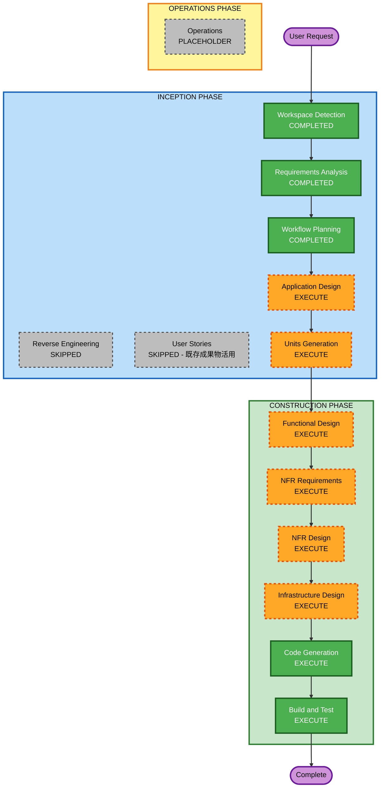

# Execution Plan

## Detailed Analysis Summary

### Transformation Scope
- **Transformation Type**: アーキテクチャ変更（AWS → Firebase）
- **Primary Changes**: 技術スタック全面変更、データアクセスパターン変更（Lambda経由 → フロントエンド直接Firestore操作）
- **機能仕様変更**: なし（FR-00〜FR-06は維持）

### Change Impact Assessment
- **User-facing changes**: No — 機能仕様・UX設計は変更なし
- **Structural changes**: Yes — バックエンドアーキテクチャが根本的に変更（Lambda群 → フロントエンド直接操作 + 最小限Cloud Functions）
- **Data model changes**: Yes — DynamoDB → Firestore（ドキュメントDB）へのデータモデル再設計が必要
- **API changes**: Yes — REST API（API Gateway + Lambda）→ Firestore直接操作 + Cloud Functions（AI呼び出しのみ）
- **NFR impact**: Yes — セキュリティモデル変更（IAM → Firestore Security Rules）、コスト制約追加

### Risk Assessment
- **Risk Level**: Medium
- **Rollback Complexity**: Easy（Greenfield・コード未生成）
- **Testing Complexity**: Moderate（Firestore Security Rules のテスト、Cloud Functions のテスト）

## Workflow Visualization



### Text Alternative
```
Phase 1: INCEPTION
- Workspace Detection (COMPLETED)
- Reverse Engineering (SKIPPED - Greenfield)
- Requirements Analysis (COMPLETED)
- User Stories (SKIPPED - 既存成果物活用)
- Workflow Planning (COMPLETED)
- Application Design (EXECUTE)
- Units Generation (EXECUTE)

Phase 2: CONSTRUCTION
- Functional Design (EXECUTE)
- NFR Requirements (EXECUTE)
- NFR Design (EXECUTE)
- Infrastructure Design (EXECUTE)
- Code Generation (EXECUTE)
- Build and Test (EXECUTE)

Phase 3: OPERATIONS
- Operations (PLACEHOLDER)
```

## Phases to Execute

### 🔵 INCEPTION PHASE
- [x] Workspace Detection - COMPLETED
- [ ] Reverse Engineering - SKIPPED（Greenfield）
- [x] Requirements Analysis - COMPLETED
- [ ] User Stories - SKIPPED
  - **Rationale**: 既存のstories.md・personas.md・ux-design.mdは技術スタックに依存しない機能仕様・UX設計であり、そのまま活用可能。機能仕様に変更なし。
- [x] Workflow Planning - COMPLETED
- [ ] Application Design - EXECUTE
  - **Rationale**: バックエンドアーキテクチャが根本的に変更（Lambda群 → Firestore直接操作 + Cloud Functions最小限）。コンポーネント構成・サービス層・データモデル・依存関係の全面再設計が必要。
- [ ] Units Generation - EXECUTE
  - **Rationale**: Firebaseアーキテクチャに基づくユニット分解が必要。前回のUnit構成（認証基盤・料理管理・献立提案・ガチャ・AIキャラクター・フロントエンド）はAWS前提のため再検討が必要。

### 🟢 CONSTRUCTION PHASE
- [ ] Functional Design - EXECUTE
  - **Rationale**: Firestoreドキュメント構造・Security Rules・Cloud Functions設計の詳細化が必要
- [ ] NFR Requirements - EXECUTE
  - **Rationale**: Firebase無料枠制約・セキュリティ要件（Security Extension適用）・コスト最適化の詳細設計が必要
- [ ] NFR Design - EXECUTE
  - **Rationale**: Firestore Security Rules設計・Cloud Functions最適化・コスト監視の設計が必要
- [ ] Infrastructure Design - EXECUTE
  - **Rationale**: Firebase プロジェクト構成・Firestore インデックス・Cloud Functions デプロイ設定の設計が必要
- [ ] Code Generation - EXECUTE (ALWAYS)
  - **Rationale**: 実装コード生成
- [ ] Build and Test - EXECUTE (ALWAYS)
  - **Rationale**: ビルド・テスト・検証

### 🟡 OPERATIONS PHASE
- [ ] Operations - PLACEHOLDER

## Success Criteria
- **Primary Goal**: Firebase無料枠内で運用可能な、日常的に使えるDAMESIアプリの完成
- **Key Deliverables**:
  - React + TypeScript フロントエンド（レスポンシブ）
  - Firestore データモデル + Security Rules
  - Cloud Functions（Claude API呼び出し用）
  - Firebase Authentication 統合
  - 全Must機能（FR-00〜FR-03, FR-05シングルガチャ）の実装
- **Quality Gates**:
  - Firestore Security Rules のテスト通過
  - Firebase無料枠内での動作確認
  - Claude APIキーがフロントエンドに露出しないことの確認
  - セキュリティルール（SECURITY-01〜15）の適用確認
